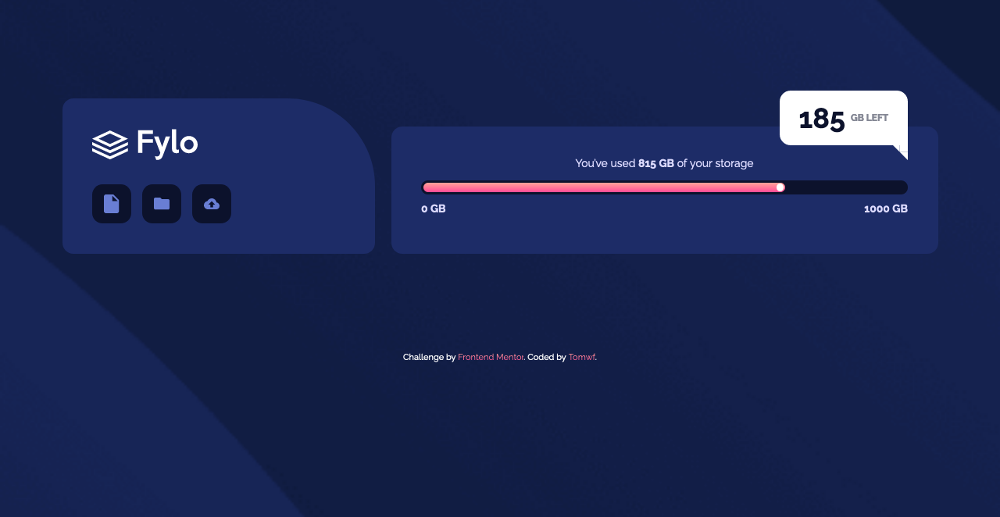
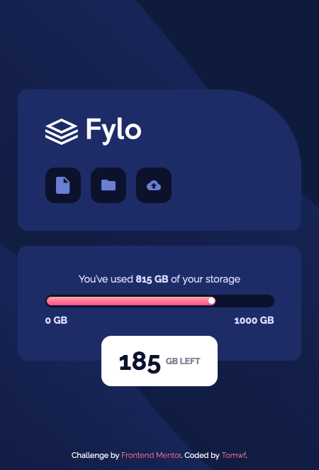

# Frontend Mentor - Fylo data storage component solution

This is a solution to the [Fylo data storage component challenge on Frontend Mentor](https://www.frontendmentor.io/challenges/fylo-data-storage-component-1dZPRbV5n). Frontend Mentor challenges help you improve your coding skills by building realistic projects. 

## Table of contents

- [Overview](#overview)
  - [The challenge](#the-challenge)
  - [Screenshot](#screenshot)
  - [Links](#links)
- [My process](#my-process)
  - [Built with](#built-with)
  - [What I learned](#what-i-learned)
  - [Useful resources](#useful-resources)

## Overview

### The challenge

Users should be able to:

- View the optimal layout for the site depending on their device's screen size

### Screenshot

#### Desktop Version


#### Mobile Version


### Links

- Live Site URL: [fylo-data-storage-component-master](https://your-live-site-url.com)

## My process

### Built with

- Semantic HTML5 markup
- CSS custom properties
- Flexbox
- Mobile-first workflow
- Sass

### What I learned

Speech bubble "tail" css:
```css
&::after {
  content: '';
  width: 0;
  height: 0;
  border-top: .75em solid $white;
  border-right: .75em solid $white;
  border-bottom: .75em solid transparent;
  border-left: .75em solid transparent;
}
```

### Useful resources

- [chat bubbles - Dave Alger](https://codepen.io/run-time/pen/VNRBJd) - This helped me to do the speech bubble's "tail".
